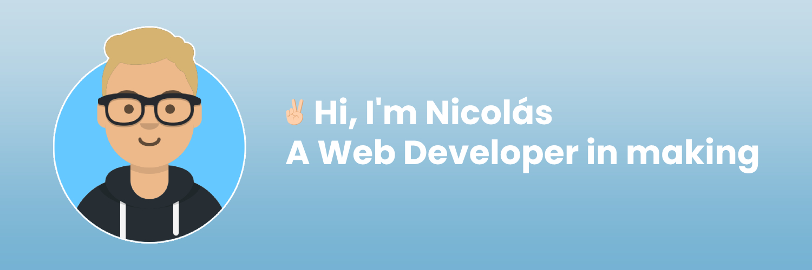

I'm a software student 🎓 from Argentina. I am a passionate learner who is always willing to learn and work across technologies and domains. 
I love to explore new technologies and leverage them to solve real-life problems. I am currently into Full Stack Web Developer and working on improve my learned skills 🤓.

 

<b>Should you want to know more about me, feel free to read below!</b>

  

## 💻 **Technology Stack**

<table align="center">
  <tr>
    <td align="center" width="100">
      
       HTML5
    </td>
    <td align="center" width="100">
      
       CSS3
    </td>
    <td align="center" width="100">
      
       JavaScript
    </td>
    <td align="center"  width="100">
      
       Sass
    </td>

  </tr>
    <td align="center" width="100">
      
       React
    </td>
    <td align="center" width="100">
      
       Redux
    </td>
    </td>
    <td align="center" width="100">
      
       Node.js
    </td>
    <td align="center" width="100">
      
       Bootstrap
    </td>
  </tr>
    <tr>
    <td align="center" width="100">
      
       Git
    </td>
    <td align="center" width="100">
      
       Github
    </td>
    <td align="center" width="100">
      
       MySQL
    </td>
  </tr>
</table>

## 💡 My GitHub stats

## 📩 **Lets talk!**

